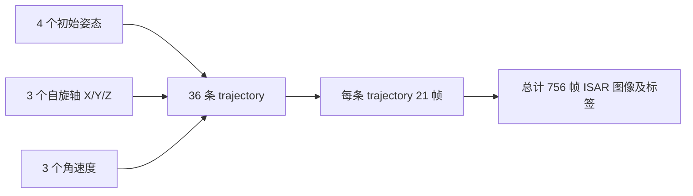

# ISAR 图像序列旋转状态估计数据集生成说明

## 1. 🎯 项目目标

本项目面向空间目标 ISAR 图像序列的旋转状态估计任务，目标是将原始 ISAR 成像流程整理为一个可用于深度学习训练的数据集生成管线。

当前数据集不只是保存 ISAR 图像，而是同步保存每一帧对应的姿态、旋转轴、角速度、时间信息和 trajectory / frame 级元数据。

后续可以基于该数据集开展：

- 单帧姿态估计；
- 相邻帧相对旋转估计；
- 序列级旋转轴估计；
- 序列级角速度估计；
- ISAR 图像序列到旋转状态的联合估计。

---

## 2. 🧭 数据生成总体流程

当前数据集生成流程可以概括为：


整体逻辑可以理解为：

```text
一次过站观测 → 合法成像时刻 → 旋转状态组合 → 逐帧成像 → 结构化数据集
```

其中：

- **时间轴采样与边界过滤**：按固定帧间隔选取成像时刻，并去掉首尾不安全区域；
- **旋转状态组合**：组合初始姿态、自旋轴和角速度，形成多条 trajectory；
- **逐帧姿态计算与点云旋转**：根据相对时间计算当前姿态，并作用到目标点云；
- **ISAR 成像与保存**：生成图像，并同步保存姿态、运动参数和 metadata。

---

## 3. 🧩 数据采样与 trajectory 构造

当前观测数据的时间间隔为 `0.1 s`，也就是每秒约 10 个观测点。

ISAR 图像的帧间隔设置为 `10 s`，因此相当于：

```text
每 100 个观测点选取 1 个成像中心点
```

同时，由于 ISAR 成像需要使用成像中心前后的一段观测数据，因此程序会去掉过站开头和结尾各 `50 s` 的边界区域，只保留中间安全的成像时刻。

当前一次运行中：

```text
合法成像中心点数 = 21
```

一条 trajectory 表示：

> 在同一个初始姿态、同一个自旋轴、同一个角速度条件下，沿时间轴生成的一组 ISAR 图像序列。

当前 trajectory 的组合方式为：

```text
4 个初始姿态 × 3 个自旋轴 × 3 个角速度 = 36 条 trajectory
```

因此当前总帧数为：

```text
36 条 trajectory × 21 帧 = 756 帧
```

数据组织关系可以表示为：



---

## 4. 🔄 trajectory 内部的姿态变化

在一条 trajectory 内部，初始姿态、自旋轴和角速度保持不变，变化的是目标随时间累积的自旋角。

对于任意一帧：

```matlab
t_rel_s = timestamp_s - start_timestamp_s;
OmegaRR = omega * t_rel_s;
R_spin  = rot(rot_axis, OmegaRR);
R_t     = R_init * R_spin;
q_t     = quatmultiply(q_init, q_spin);
```

其中：

| 变量 | 含义 | 变量 | 含义 | 变量 | 含义 |
|---|---|---|---|---|---|
| `t_rel_s` | 相对起始帧时间 | `OmegaRR` | 累计自旋角 | `R_spin` | 自旋旋转矩阵 |
| `R_t` | 当前帧姿态矩阵 | `q_t` | 当前帧四元数 | `omega` | 角速度 |

首帧满足：

```text
t_rel_s = 0
R_spin = I
R_t = R_init
q_t = q_init
```

因此，每条 trajectory 都是从一个确定的初始姿态开始，按照给定角速度连续旋转得到的图像序列。

---

## 5. 🧱 点云旋转与 ISAR 成像

每一帧图像生成前，程序会先根据当前姿态 `R_t` 对目标点云进行旋转：

```matlab
ISARparam.point = Cor_point0 * ZoomingFac * R_t.';
```

然后进入 ISAR 成像流程：

```text
旋转后的目标点云
    ↓
观测几何计算
    ↓
成像轴变换
    ↓
ISAR 成像
    ↓
输出当前帧 ISAR 图像
```

这一点比较关键：当前图像中的目标形态变化不是后处理得到的，而是由姿态变化真实作用到目标点云后，再经过 ISAR 成像流程生成的。

---

## 6. 🏷 每帧保存的信息

当前每一帧 `.mat` 文件主要保存以下信息：

| 字段 | 含义 | 字段 | 含义 | 字段 | 含义 |
|---|---|---|---|---|---|
| `image` | ISAR 图像 | `raw_abs` | 图像幅度 | `R_t` | 当前姿态矩阵 |
| `q_t` | 当前姿态四元数 | `R_init` | 初始姿态矩阵 | `q_init` | 初始姿态四元数 |
| `rot_axis` | 自旋轴 | `omega` | 角速度 | `timestamp_s` | 当前帧时间戳 |
| `t_rel_s` | 相对时间 | `keypoint_ran` | 距离向关键点 | `keypoint_azi` | 方位向关键点 |

这些信息使得每一帧图像都可以和明确的姿态、旋转状态对应起来，便于后续构造监督学习任务。

---

## 7. 📁 数据集输出结构

当前数据集按照 trajectory / frame 两级组织：

```text
dataset/
├── frames_mat/
│   └── traj_000001/
│       ├── frame_000001.mat
│       ├── frame_000002.mat
│       └── ...
├── preview_png/
│   └── traj_000001/
│       ├── frame_000001.png
│       ├── frame_000002.png
│       └── ...
├── preview_oldstyle_png/
│   └── traj_000001/
│       ├── frame_000001.png
│       ├── frame_000002.png
│       └── ...
└── metadata/
    ├── frames.csv
    └── trajectories.csv
```

| 文件 / 目录 | 作用 | 文件 / 目录 | 作用 |
|---|---|---|---|
| `frames_mat/` | 保存训练主数据 | `preview_png/` | 保存灰度预览图 |
| `preview_oldstyle_png/` | 保存原风格伪彩色预览图 | `frames.csv` | 保存帧级索引与标签信息 |
| `trajectories.csv` | 保存轨迹级参数信息 |  |  |

---

## 8. ⚙️ 当前默认参数设置

### 8.1 观测与采样参数

| 参数 | 当前值 | 说明 | 参数 | 当前值 | 说明 |
|---|---:|---|---|---:|---|
| 观测点时间间隔 | 0.1 s | 每 0.1 秒一个观测点 | `prf` | 10 Hz | 轨道数据采样率 |
| `intrv` | 10 s | ISAR 图像帧间隔 | `margin_s` | 50 s | 前后边界保护 |
| `current_pass` | 1 | 当前使用第 1 圈过站 | 单次过站观测点数 | 约 3086 | 约 308 秒 |
| 合法成像中心点数 | 21 | 每条 trajectory 帧数 | 总帧数 | 756 | 36 × 21 |

### 8.2 雷达与成像参数

| 参数 | 当前值 | 说明 | 参数 | 当前值 | 说明 |
|---|---:|---|---|---:|---|
| `fc` | 16.7 GHz | 雷达载频 | `lambda` | 0.0180 m | 波长 |
| `DeltaR` | 0.08 m | 距离分辨率 | `DeltaA` | 0.08 m | 方位分辨率 |
| `nrn` | 512 | 距离向像素数 | `nan` | 512 | 方位向像素数 |
| `DDtheta` | 0.1123 rad | 合成孔径角阈值 | `The_Are` | 0.024 | 面散射强度因子 |
| `ZoomingFac` | 0.0016 | 点云缩放因子 |  |  |  |

### 8.3 旋转状态参数

| 参数 | 当前值 | 说明 | 参数 | 当前值 | 说明 |
|---|---:|---|---|---:|---|
| `pose_id_list` | `999:1800:8100` | 初始姿态编号 | 初始姿态数量 | 4 | 999、2799、4599、6399 |
| `rot_axis_list` | X / Y / Z | 3 个体轴方向 | `omega_list` | 0.005 / 0.015 / 0.03 rad/s | 3 个角速度 |
| `omega_acc` | 0 | 恒速自旋 | trajectory 数量 | 36 | 4 × 3 × 3 |

---

## 9. 📊 当前数据规模小结

当前一次运行结果为：

| 层级 | 含义 | 当前数量 |
|---|---|---:|
| 合法成像中心点 | 一次过站中可用于成像的时间点 | 21 |
| trajectory | 一组初始姿态、自旋轴、角速度组合 | 36 |
| frame | 单帧 ISAR 图像及其标签 | 756 |

可以概括为：

```text
当前数据集 = 36 条 ISAR 图像序列
每条序列 = 21 帧
总计 = 756 帧图像及对应旋转状态标签
```
